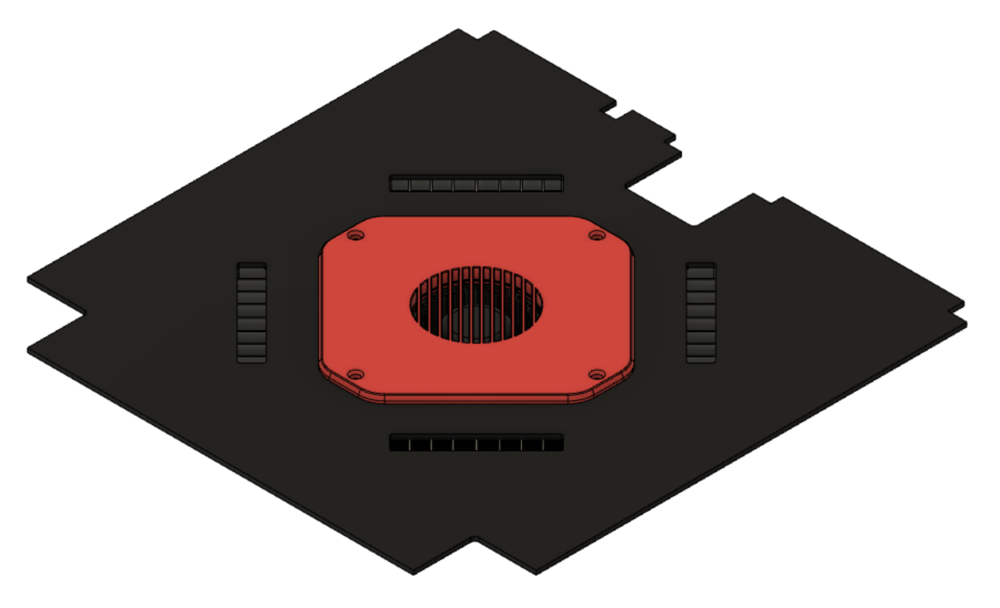
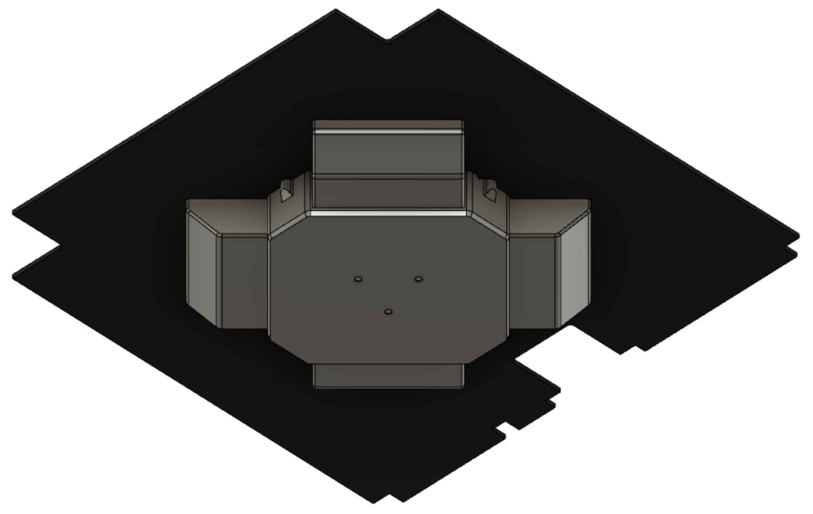
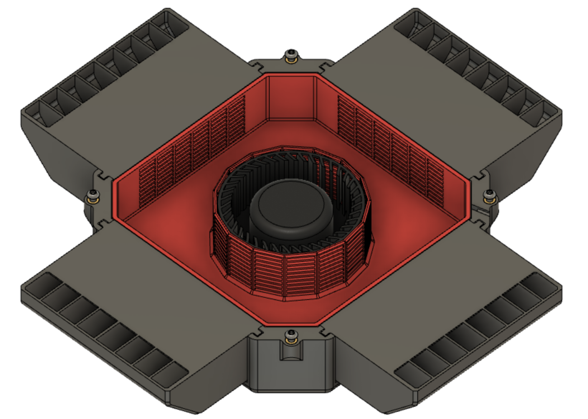

# Air Filter for Voron Trident - Sidepack

**DISCLAIMER**: This is NOT an official Voron design.

## Why

Inspired by Nevermore Max, Nevergrater and Funny Pack, I created this one to install under the deck panel of my Sidepack.

## BOM

- 1x GPU Cooling Fan - Suggested BFB0712HF
  - [Amazon](https://www.amazon.com/dp/B09LSF5Y2C)
  - [Ali Express](https://www.aliexpress.us/item/2251832490936587.html)
- 4x M3x8 BHCS and 4 M3x8 FHCS or
- 8x M3x8 BHCS
- 8 M3 Threaded inserts
- Carbon pellets 

## Renders

  

  

  

