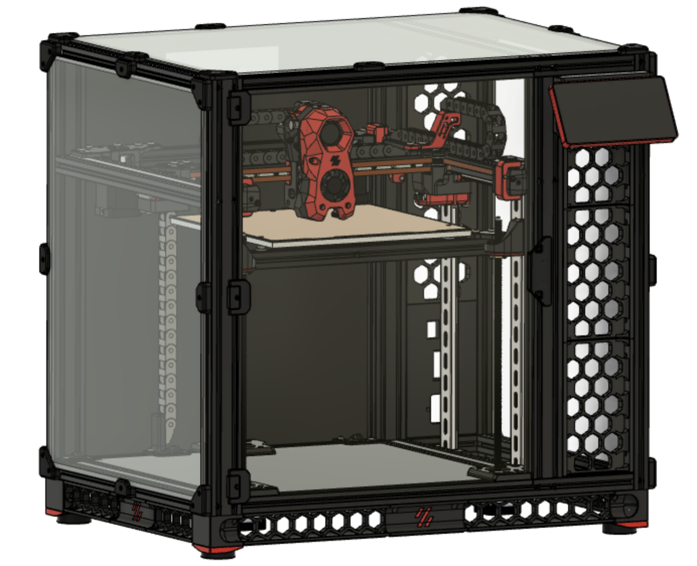

# Voron Trident - Sidepack

**DISCLAIMER**: This is NOT an official Voron design.

Mod designed by `kyledavis417#2007`.

<p align="center">
  
</p>

<p align="center">
  
</p>

`kyledavis417#2007` build, based on the V1.8 frame. Picture by `Kayosmaker`.


## Frame

All the dimensions below reflect a Trident 250mm build.

### Corners

<p align="center">
  
</p>

```
2x HFSB5-2020-500-LCP-RCP
2x HFSB5-2040-500-LCP-RCP-AH360
2x HFSB5-2040-460-TPW-AH340 
```

### Bottom

<p align="center">
  
</p>

```
2x HFSB5-2020-500-TPW-AH380-BH400-AP380-BP400
2x HFSB5-2040-370-TPW
1x HFSB5-2020-370-TPW
```

### Top

<p align="center">
  
</p>

```
2x HFSB5-2020-500-TPW-AH380-BH400-AP380-BP400
2x HFSB5-2040-370-TPW
1x HFSB5-2020-370-TPW
```

### Gantry

<p align="center">
  
</p>

```
2x HFSB5-2040-370-TPW
1x HFSB5-2020-240
1x HFSB5-2020-330
```

### Bed

<p align="center">
  
</p>

```
1x HFSB5-2020-370-AH185
1x HFSB5-2020-232-LTP
```

### Rear

<p align="center">
  
</p>

```
1x HFSB5-2020-330-LTP
```

# Builds

## Verethy

<p align="center">
  
</p>

<p align="center">
  
</p>

## Genevamotion

<p align="center">
  
</p>

<p align="center">
  
</p>

## DoubleT

<p align="center">
  
</p>